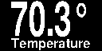

# airgraident-displaycontrol

AirGradient with prometheus exporter and remote display control.

This connects an AirGradient DIY Pro sensor to a WiFi network
with an HTTP server to provide prometheus-style metrics and to allow the
display OLED display to be programmed remotely.

Urls:
- `GET /metrics` - prometheus data
- `POST /setscreen2` - upload data for the 2nd screen. Variables passed through the POST data:
  - `watt / wattavg / water / watertoday / garage / garagetime` - values for the 2nd screen
  - `oledInterval` - the ms between oled updates
- `POST /uploadscreen` - upload additional screens, to be shown on the OLED. Vars:
  - `d0 ... d19` - up to 20 different screens
  - Each screen is in the [XBM](https://en.wikipedia.org/wiki/X_BitMap) format / 1024 chars, each bit is a pixel
  - Recommend 1 screen updated at a time to keep byte count low.

Default screen setup:
1. Show the Airgradient data, all on one screen.
1. Show the (next) custom screen, if it exists
1. Show the external 2nd screen data, if it has been provided. If no data was provided, go back to #1.
1. Show the (next) custom screen, if it exists.  Repeat back to #1.

This work is based heavily on:
-  Airgradient code: https://github.com/airgradienthq/arduino/blob/master/examples/DIY_PRO_V4_2/
-  Jeff's airgraident-prometheus: https://github.com/geerlingguy/airgradient-prometheus

Written for a AirGradient DIY PRO 4.2 with a SGP41 TVOC module.

---

## Examples of screens that can be uploaded

---

## Installation Instructions

Use the [Arduino software](https://www.arduino.cc/en/main/software) to install the image in the arduino/ directory to the Airgradient system.
- [Airgradient](https://www.airgradient.com/open-airgradient/instructions/basic-setup-skills-and-equipment-needed-to-build-our-airgradient-diy-sensor/) installation instructions
- Make any configuration changes necessary in the code, including specifying the wifi settings for the Airgradient in the code itself
- Install the software using a connecton to the internal USB port.  The external USB port on the Airgradient only provides power.

